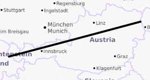

# investigate-gpx


#### !!! test implementation, works with TRACKS only!!!

```
git clone https://github.com/BergWerkGIS/investigate-gpx.git
cd investigate-gpx
npm install
```

#### create a simple GPX file with one track consisting of 500 points (and data|style.xml):

```
node create-gpx.js austria-500.gpx --bounds=9.60705,47.06077,16.84520,48.34949 --nr_of_points=500
```



-----

use `<file>.gpx.data.xml` to eport to `pbf`

use `<file>.gpx.style.xml` to export to `webp`

-----


export to webp, z4 only, including bbox.

finishes in seconds, creates **1** tile:

```
node bench.js austria-500.gpx.style.xml . --minzoom=4 --maxzoom=4 --verbose --output=tiles --bounds=9.60705,47.06077,16.84520,48.34949
```

export to webp, z4 only, without bbox.

takes longer, creates **256** tiles:

```
node bench.js austria-500.gpx.style.xml . --minzoom=4 --maxzoom=4 --verbose --output=tiles
```

z12, with bbox, fast:

```
node bench.js austria-500.gpx.data.xml . --minzoom=12 --maxzoom=12 --verbose --output=tiles --bounds=9.60705,47.06077,16.84520,48.34949
```

z12, without bbox:

```
node bench.js austria-500.gpx.data.xml . --minzoom=12 --maxzoom=12 --verbose --output=tiles --bounds=9.60705,47.06077,16.84520,48.34949
```

results in:

```
[Error: Copy operation timed out]
```

-----

#### use an existing GPX file

**works with tracks only!**

```
node create-xmls-for-existing-gpx.js cijleok59002btrkoebxdjvlz.gpx
```

fast and creates 1 tile:

```
node bench.js cijleok59002btrkoebxdjvlz.gpx.style.xml . --minzoom=6 --maxzoom=6 --verbose --output=tiles --bounds=-3.501541,53.067603,-1.223474,53.731554
```


slow and creates 4096 tiles:

```
node bench.js cijleok59002btrkoebxdjvlz.gpx.style.xml . --minzoom=6 --maxzoom=6 --verbose --output=tiles
```
